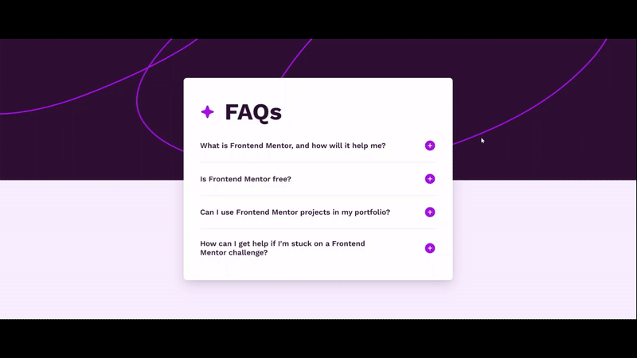

# Frontend Mentor - FAQ accordion solution

This is a solution to the [FAQ accordion challenge on Frontend Mentor](https://www.frontendmentor.io/challenges/faq-accordion-wyfFdeBwBz). Frontend Mentor challenges help you improve your coding skills by building realistic projects.

## Table of Contents

- [Overview](#overview)
  - [The Challenge](#the-challenge)
  - [Preview](#preview)
  - [Links](#links)
- [About](#about)
  - [License](#license)
  - [Author](#author)

## Overview

### The Challenge

Users should be able to:

- Hide/Show the answer to a question when the question is clicked
- Navigate the questions and hide/show answers using keyboard navigation alone
- View the optimal layout for the interface depending on their device's screen size
- See hover and focus states for all interactive elements on the page

### Preview

### Links

- Solution URL:
- Live Site URL:

## About

### License

This project is licensed under the MIT License - see the [LICENSE](LICENSE) file for details.

### Author

- GitHub - [@Denislav-Dimov](https://github.com/Denislav-Dimov)
- Frontend Mentor - [@Denislav-Dimov](https://www.frontendmentor.io/profile/Denislav-Dimov)
